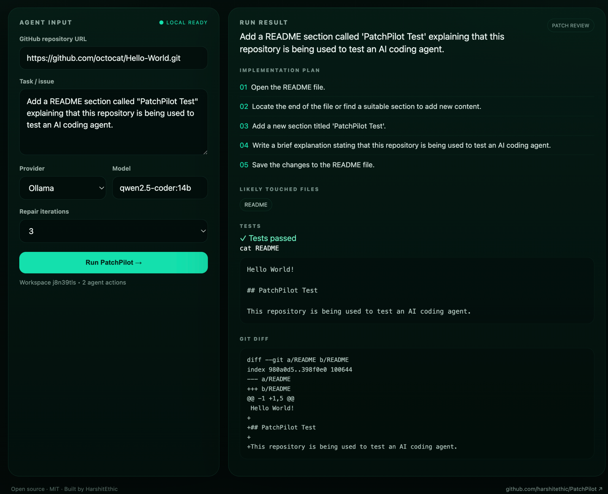
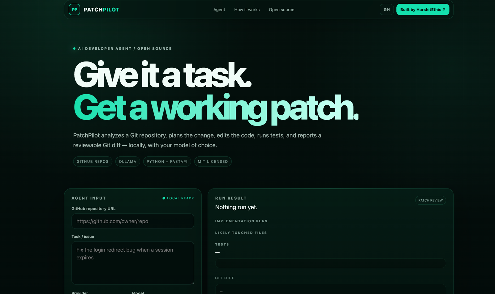
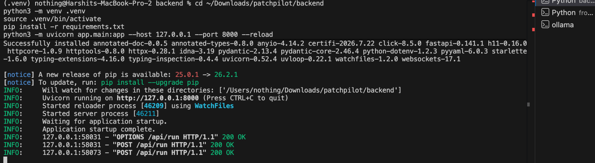
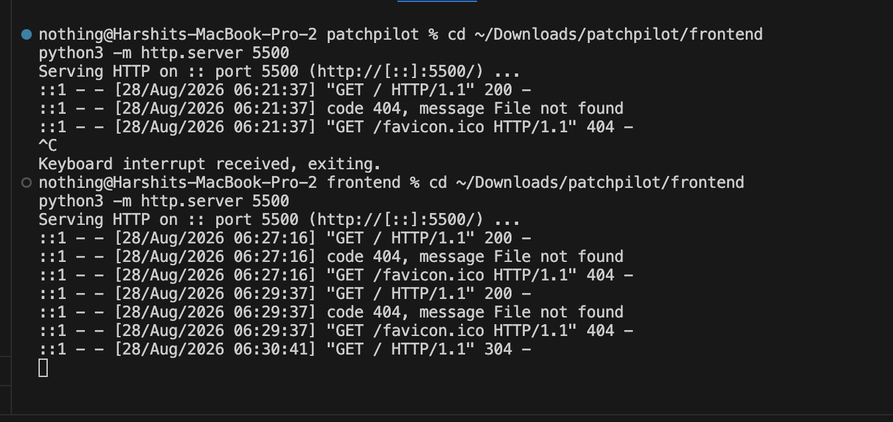

# PatchPilot 🚀

> **An open-source AI developer agent that turns repository tasks into reviewable code changes.**

**Built by [HarshitEthic](https://github.com/harshitethic)** · Open source · MIT licensed

PatchPilot is a local-first developer tool for giving an AI agent a real Git repository and a concrete engineering task. It analyzes the codebase, creates an implementation plan, generates structured file edits, applies them in an isolated workspace, runs detected tests, and exposes the resulting Git diff for review.

It is designed to sit **between an issue and a pull request** — with the developer kept in control of the final change.

---

## ✨ What PatchPilot does

```text
┌────────────────────┐
│ GitHub repository  │
└─────────┬──────────┘
          ↓
┌────────────────────┐
│ Task / GitHub issue│
└─────────┬──────────┘
          ↓
┌────────────────────┐
│ Analyze repository │
└─────────┬──────────┘
          ↓
┌────────────────────┐
│ Implementation plan│
└─────────┬──────────┘
          ↓
┌────────────────────┐
│ Create isolated    │
│ Git branch         │
└─────────┬──────────┘
          ↓
┌────────────────────┐
│ Generate file edits│
└─────────┬──────────┘
          ↓
┌────────────────────┐
│ Apply changes      │
└─────────┬──────────┘
          ↓
┌────────────────────┐
│ Run tests          │
└─────────┬──────────┘
          ↓
┌────────────────────┐
│ Repair if needed   │
└─────────┬──────────┘
          ↓
┌────────────────────┐
│ Review Git diff    │
└────────────────────┘
```

### Current capabilities

- 🧠 Repository-aware task planning
- ✍️ Structured code/file editing instead of trusting raw model-generated diffs
- 🧪 Automatic test-command detection and execution
- 🔁 Limited repair loop when tests fail
- 🌿 **Automatic isolated Git branch per run**
- 🐙 **GitHub issue import via API**
- 📦 Isolated per-run workspaces
- 🔍 Reviewable Git diffs
- 🏠 Local-first LLM support with Ollama
- 🔌 OpenAI/OpenRouter-compatible provider support
- ⚡ FastAPI backend + lightweight web UI
- 🐳 Docker support for the backend

---

## 🆕 New in v0.4

### Import GitHub issues

PatchPilot can now turn a GitHub issue into an agent task instead of making you copy the issue manually.

```http
POST /api/import-issue
Content-Type: application/json

{
  "repo": "owner/project",
  "issue_number": 42
}
```

The response contains the issue title, description, URL, and a normalized `task` string ready for the agent.

A direct lookup is also available:

```http
GET /api/github/issue?repo=owner/project&issue_number=42
```

Set `GITHUB_TOKEN` in `backend/.env` before using these endpoints. The token is never returned by the API.

### Automatic isolated branches

Every agent run now creates a branch before applying changes:

```text
main
  └── patchpilot/fix-login-a1b2c3d4
          ├── AI edits
          ├── tests
          └── reviewable diff
```

You can provide a branch name in the run request:

```json
{
  "repo_url": "https://github.com/owner/project.git",
  "task": "Fix the expired-session redirect",
  "branch_name": "fix/expired-session"
}
```

If omitted, PatchPilot generates a unique `patchpilot/...` branch name automatically.

**Important:** the current version creates the branch only inside PatchPilot's cloned workspace. It does **not** push the branch to GitHub yet. Remote commits and pull requests remain future roadmap items.

---

## 🎯 Why PatchPilot?

Most AI coding demos stop at **"generate some code."** PatchPilot is built around the engineering loop that happens after the generation:

**understand → change → test → repair → review**

The goal is not to replace a developer. The goal is to remove repetitive repository work while keeping the generated change visible and reviewable.

---

## 🧑‍💻 Use cases

### 1. Fix a GitHub issue

Import an issue directly:

```text
owner/project #42
```

PatchPilot retrieves the title and description and turns them into an agent task.

### 2. Add a small feature

```text
Add a /health endpoint that returns the service status as JSON.
```

Useful for small, well-scoped changes where you still want a human-readable diff before merging.

### 3. Refactor existing code

```text
Extract the duplicated validation logic into a reusable helper.
```

PatchPilot can make the change inside a temporary workspace and show the resulting diff.

### 4. Generate tests

```text
Add unit tests for the password validation edge cases.
```

### 5. Explore an unfamiliar repository

Use the planning stage as a fast first pass over an unfamiliar codebase before making the change yourself.

---

## 🔌 API

| Endpoint | Method | Purpose |
|---|---|---|
| `/api/health` | GET | Service health check |
| `/api/run` | POST | Clone, plan, edit, test, repair, and return a diff |
| `/api/execute` | POST | Execute a command inside an existing workspace |
| `/api/workspace` | POST | Inspect workspace files and current diff |
| `/api/github/issue` | GET | Fetch a GitHub issue |
| `/api/import-issue` | POST | Convert a GitHub issue into an agent task |
| `/api/openapi-summary` | GET | Return PatchPilot feature metadata |

The FastAPI application also exposes its generated API documentation when the backend is running:

```text
http://127.0.0.1:8000/docs
```

---

## 🏗️ Architecture

```text
                     ┌──────────────────────┐
                     │   PatchPilot Web UI  │
                     └──────────┬───────────┘
                                │ HTTP
                                ↓
                     ┌──────────────────────┐
                     │     FastAPI API      │
                     └──────────┬───────────┘
                                │
              ┌─────────────────┼─────────────────┐
              ↓                 ↓                 ↓
       ┌─────────────┐   ┌─────────────┐   ┌─────────────┐
       │ Git / Repo  │   │ LLM Provider│   │ Test Runner │
       │ + Branches  │   │ Ollama/API  │   │ + git diff  │
       └─────────────┘   └─────────────┘   └─────────────┘
              ↑
              │
       ┌─────────────┐
       │ GitHub API  │
       │ Issue import│
       └─────────────┘
```

### Tech stack

- **Backend:** Python, FastAPI
- **Agent model:** Ollama / OpenAI-compatible APIs
- **Default model:** `qwen2.5-coder:14b`
- **Repository operations:** Git
- **GitHub integration:** GitHub REST API
- **Frontend:** HTML, CSS, vanilla JavaScript
- **Deployment:** Docker / Docker Compose

---

## ⚡ Quick start — macOS / Apple Silicon

PatchPilot works especially well as a local tool with Ollama.

### 1. Clone the project

```bash
git clone https://github.com/harshitethic/PatchPilot.git
cd PatchPilot
```

### 2. Start Ollama

Install Ollama from the official installer, then make sure the model is available:

```bash
ollama pull qwen2.5-coder:14b
ollama list
```

You do **not** need to run `ollama serve` if the Ollama application/server is already running.

### 3. Configure GitHub issue import

Copy the example environment file:

```bash
cd backend
cp .env.example .env
```

Then add a GitHub token:

```text
GITHUB_TOKEN=your_github_token
```

The token needs permission to read the repositories/issues you want PatchPilot to import. Keep `.env` private and never commit it.

### 4. Set up the backend

```bash
python3 -m venv .venv
source .venv/bin/activate
pip install -r requirements.txt
python3 -m uvicorn app.main:app --host 127.0.0.1 --port 8000 --reload
```

Verify:

```bash
curl http://127.0.0.1:8000/api/health
```

### 5. Start the frontend

Open another terminal:

```bash
cd frontend
python3 -m http.server 5500
```

Then open:

```text
http://localhost:5500
```

---

## 🧪 Example

Repository:

```text
https://github.com/octocat/Hello-World.git
```

Task:

```text
Add a README section called "PatchPilot Test" explaining that this repository is being used to test an AI coding agent.
```

A successful run should produce:

- an implementation plan
- an isolated branch name
- the likely files to change
- a test result
- the applied file changes
- a final Git diff

### GitHub issue workflow

```text
GitHub issue #42
       ↓
/api/import-issue
       ↓
Normalized agent task
       ↓
/api/run
       ↓
New isolated branch
       ↓
AI implementation
       ↓
Tests + repair loop
       ↓
Reviewable diff
```

---

## 📸 Screenshots

### PatchPilot dashboard

The local-first agent UI: provide a GitHub repository, describe the task, choose the model/provider, and run the agent.



### Agent run result

PatchPilot returns the implementation plan, touched files, validation output, and the resulting Git diff for review.



### FastAPI backend

The backend runs locally and exposes the PatchPilot API on `127.0.0.1:8000`.



### Local frontend

The frontend can be served locally with a lightweight Python HTTP server.



## 🔐 Security model

PatchPilot is an **MVP and local developer tool**. Do not expose the current backend directly to the public internet.

The agent can clone repositories and execute detected project commands inside a workspace. Before using PatchPilot in an untrusted or multi-user environment, add:

- container or VM isolation
- CPU, memory, disk, and execution-time limits
- network isolation
- authenticated API access
- command and path allowlists
- secret isolation
- explicit human approval before write/push/PR actions

GitHub issue import also introduces a credential boundary: keep `GITHUB_TOKEN` server-side and use the minimum permissions required.

The project roadmap intentionally includes a stronger sandbox for this reason.

---

## 🗺️ Roadmap

### v0.x — Agent core

- [x] Repository cloning
- [x] Task analysis
- [x] Implementation planning
- [x] Structured file edits
- [x] Test execution
- [x] Repair loop
- [x] Reviewable Git diff

### v0.4 — Repository workflow

- [x] GitHub issue import
- [x] Automatic isolated branches
- [ ] Commit changes from the agent
- [ ] Open pull requests automatically

### Next

- [ ] GitHub App authentication
- [ ] Streaming agent events
- [ ] File-aware tool calling
- [ ] Strong sandboxing with Docker / microVMs
- [ ] Human approval gates
- [ ] Persistent runs and history
- [ ] CLI: `patchpilot run "Fix the auth bug"`
- [ ] Multi-agent code review

---

## 🤝 Contributing

PatchPilot is open source and contributions are welcome.

Good places to start:

- improve repository analysis
- add provider adapters
- improve test detection
- strengthen sandboxing
- build the GitHub App / PR workflow
- add language-specific repository tooling
- improve the frontend and developer experience

See the repository issues and roadmap for areas to work on.

### Development setup

```bash
git checkout -b feature/your-change
# make your changes
# run tests / checks
git diff
git commit -m "feat: your change"
```

Please keep pull requests focused and explain the behavior you changed.

---

## 📄 License

PatchPilot is released under the **MIT License**.

---

## 👤 Built by HarshitEthic

PatchPilot is built and maintained by **HarshitEthic** as an open-source developer tooling project.

GitHub: **https://github.com/harshitethic**

> Build tools developers actually want to use. Ship the source.
